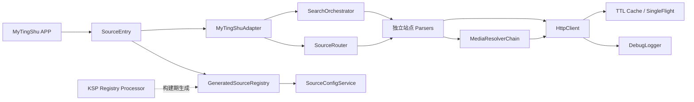
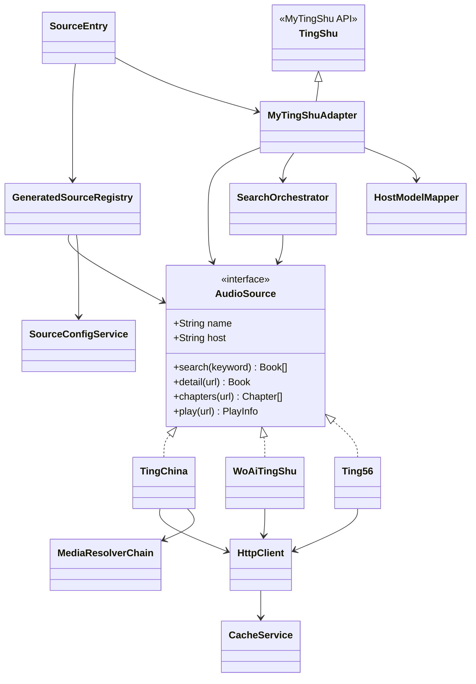
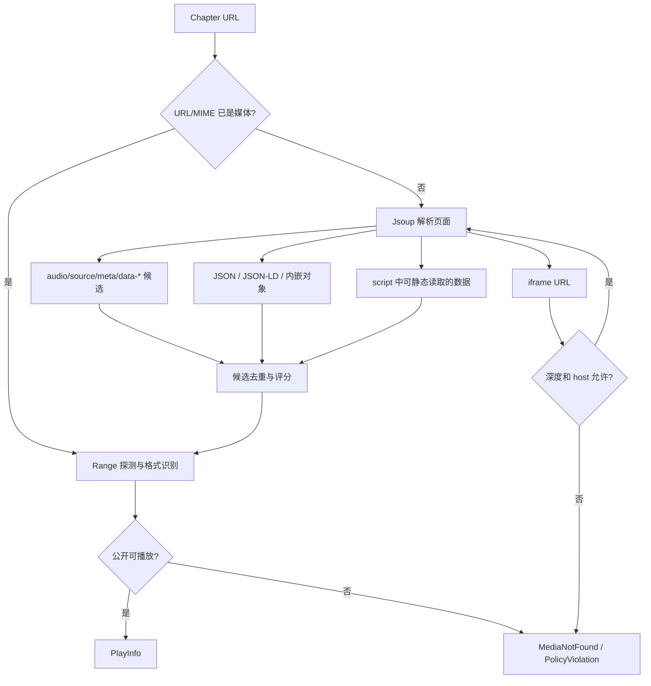
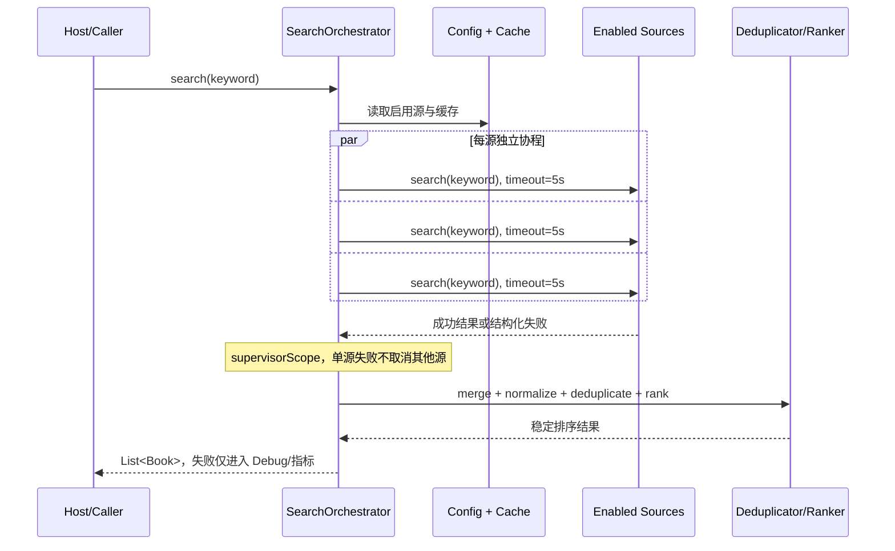

# MySound-Pro 架构设计说明书

> 文档状态：Stage 0 设计已确认；Stage 1 已通过自动化与 MyTingShu 2.6.0 宿主门禁
> 设计日期：2026-07-13
> 本阶段只做架构设计，不包含实现代码、可执行 JAR 或站点解析规则。

## 1. 结论摘要

MySound-Pro 采用六层结构：领域 API、共享核心、站点 Parser、MyTingShu 宿主适配、编译期注册生成、测试与发布工具。每个站点只负责“站点 URL + DOM/JSON 映射”，HTTP、缓存、日志、并发搜索、媒体探测、配置和更新全部下沉到公共层。

推荐的关键决策如下：

1. `AudioSource` 保留为项目内部统一契约，但四个网络方法建议改成 `suspend`；这是让 5 秒超时、取消和并发真正可控所必需的唯一接口调整。
2. MyTingShu 不直接依赖内部模型。`MyTingShuAdapter` 将 `AudioSource` 映射为宿主的 `TingShu`、`Book`、`BookDetail` 和音频提取器。
3. 不做 Android 运行时反射扫包。使用 KSP 在编译期发现所有非抽象 `AudioSource` 实现，生成 `GeneratedSourceRegistry`；新增 Parser 后无需修改列表。
4. `SourceEntry` 只调用生成的注册表并按 `config.json` 过滤，然后返回 `List<TingShu>`。该入口保持非常薄，避免宿主升级影响所有 Parser。
5. 普通 PR 运行确定性的 HTML/JSON fixture 测试；真实网站“随机 100 本”属于限速的夜间或发布前活体测试，避免 CI 因网站波动而随机失败或给站点造成压力。
6. 只接纳浏览器匿名访问、无需登录、无需会员、无需鉴权 Cookie/Token/签名、无需执行混淆脚本的站点。站点一旦违反准入规则，直接停用，不在公共层加入绕过逻辑。

## 2. 已核实的宿主事实与兼容边界

公开的 MyTingShu 示例仓库显示：

- 自定义源需要继承 `TingShu`，入口为 `SourceEntry.getSources(): List<TingShu>`，不是直接加载任意自定义接口。
- 入口包名必须由 JAR 基名派生：`my_sound_pro.jar` 对应 `com.github.eprendre.my_sound_pro.SourceEntry`。
- 发布物是经过 D8 转换、供 Android 加载的 JAR，而不只是普通 JVM JAR。
- 宿主支持订阅 JSON，并按数字 `version`、`entry_package` 和 `download_url` 检查更新。
- 公开接口注释至少包含 2.5.9 加入的自定义配置能力。

参考资料：

- [MyTingShu 公开仓库与自定义源说明](https://github.com/eprendre/tingshu)
- [公开 SourceEntry 示例](https://github.com/eprendre/tingshu/blob/master/CustomSources/src/main/kotlin/com/github/eprendre/sources_by_eprendre/SourceEntry.kt)
- [公开 TingShu 宿主契约](https://github.com/eprendre/tingshu/blob/master/CustomSources/src/main/kotlin/com/github/eprendre/tingshu/sources/TingShu.kt)
- [公开 Gradle/D8 打包示例](https://github.com/eprendre/tingshu/blob/master/CustomSources/build.gradle)

但该公开仓库同时声明示例工程已停止维护。因此，本设计不能把公开模板等同于“当前最新版 APP 的完整 SDK”。“兼容最新版”的完成标准必须是：Stage 1 获取当前 APP 对应的公开模板或合法 API 签名，在真实 Android 设备上完成安装、加载、搜索、详情、章节和播放冒烟测试。

### 2.1 Java/Kotlin 兼容策略

- 构建工具链：JDK 17。
- 产物字节码：优先 `JVM 1.8`，再由当前兼容版本的 D8 转换。JDK 17 是构建环境，不等于强制输出 Java 17 字节码。
- Kotlin、OkHttp、Okio、Jsoup、Coroutines 必须进入“宿主依赖矩阵”。宿主已有且 ABI 稳定的库采用 `compileOnly`；协程因宿主父优先加载及 R8/加固导致 ABI 不可用，固定重定位到 `io.github.mysoundpro.shadow.coroutines`；其他宿主没有的库才考虑最小化打包或 relocation，并进行宿主验证。
- 不把来源不明或许可证不清晰的宿主二进制提交进开源仓库。必要的宿主 API stub 只保留最小签名，并记录其来源与兼容版本。

## 3. 范围与非目标

### 3.1 范围内

- 匿名公开网页的搜索、详情、章节和播放地址解析。
- MP3、AAC、M3U8/HLS 地址返回。
- DOM、内嵌 JSON、可静态读取的 script 数据、iframe 递归解析。
- 多源并发搜索、隔离失败、5 秒预算、合并、去重和稳定排序。
- 搜索、详情和章节的 5 分钟 TTL 缓存。
- Debug 可观测日志、Release 零输出。
- 外部 `config.json` 控制站点启停，无需重新编译。
- MyTingShu 订阅更新、GitHub Actions 构建、测试和发布。

### 3.2 明确不做

- 登录、会员、付费内容、账号共享。
- 固定或动态鉴权 Cookie、用户 Token、设备指纹、签名算法。
- CAPTCHA、验证码、反爬绕过、WebView 登录。
- 破解、解密、DRM、混淆 JavaScript 执行。
- 音频批量下载器或资源镜像。
- 为单一站点污染公共层的大量例外分支。
- 喜马拉雅、番茄、懒人、QQ 阅读、微信及其他会员/封闭平台。

“公开网页可打开”不自动代表可合法抓取或再分发。每个站点还必须通过服务条款、robots、访问频率和内容授权风险检查；插件只解析并交给播放器访问原站地址，不托管、不镜像音频。

## 4. 总体架构



依赖方向固定为：`host -> sources -> core -> api`。`api` 不知道 Android、MyTingShu、OkHttp 或 Jsoup；Parser 不直接调用宿主类型；宿主升级只修改适配模块。

## 5. Gradle 模块与目录结构

```text
MySound-Pro/
├─ settings.gradle.kts
├─ build.gradle.kts
├─ gradle.properties
├─ gradle/
│  ├─ libs.versions.toml
│  └─ wrapper/
├─ build-logic/
│  └─ src/main/kotlin/                 # JVM、测试、D8、发布约定插件
├─ mysound-api/
│  └─ src/main/kotlin/.../api/
│     ├─ AudioSource.kt
│     ├─ Book.kt
│     ├─ Chapter.kt
│     ├─ PlayInfo.kt
│     ├─ MediaFormat.kt
│     └─ SourceException.kt
├─ mysound-core/
│  └─ src/main/kotlin/.../core/
│     ├─ http/
│     │  ├─ HttpClient.kt
│     │  ├─ OkHttpClientFactory.kt
│     │  ├─ RetryPolicy.kt
│     │  ├─ AnonymousCookieJar.kt
│     │  └─ CharsetDecoder.kt
│     ├─ cache/
│     │  ├─ TtlCache.kt
│     │  └─ SingleFlight.kt
│     ├─ config/
│     │  ├─ SourceConfig.kt
│     │  └─ SourceConfigService.kt
│     ├─ search/
│     │  ├─ SearchOrchestrator.kt
│     │  ├─ BookDeduplicator.kt
│     │  └─ BookRanker.kt
│     ├─ media/
│     │  ├─ MediaResolverChain.kt
│     │  ├─ DirectMediaResolver.kt
│     │  ├─ HtmlMediaResolver.kt
│     │  ├─ JsonMediaResolver.kt
│     │  ├─ ScriptDataResolver.kt
│     │  ├─ IframeMediaResolver.kt
│     │  └─ MediaProbe.kt
│     └─ log/
│        ├─ Logger.kt
│        └─ DebugLogger.kt
├─ mysound-registry-processor/
│  └─ src/main/kotlin/.../registry/     # KSP 扫描与代码生成
├─ mysound-sources/
│  ├─ src/main/kotlin/.../sources/
│  │  ├─ TingChina.kt
│  │  ├─ WoAiTingShu.kt
│  │  ├─ YouShengXiaoShuoBa.kt
│  │  ├─ Ting56.kt
│  │  └─ ...                           # 每站一个文件，单文件不超过 300 行
│  └─ src/test/
│     ├─ kotlin/.../sources/
│     └─ resources/fixtures/<source>/
├─ mysound-myting-host/
│  └─ src/main/kotlin/.../mysound_pro/
│     ├─ SourceEntry.kt
│     ├─ MyTingShuAdapter.kt
│     ├─ MyTingShuAudioExtractor.kt
│     ├─ HostModelMapper.kt
│     └─ HostCompatibility.kt
├─ mysound-testkit/
│  └─ src/main/kotlin/.../testkit/
│     ├─ ParserContract.kt
│     ├─ FixtureServer.kt
│     ├─ LiveBookSampler.kt
│     └─ SuccessRateReporter.kt
├─ config/
│  └─ default-config.json
├─ release/
│  ├─ my_sound_pro.template.json
│  └─ update.template.json
├─ docs/
│  ├─ adding-a-source.md
│  ├─ compatibility-matrix.md
│  └─ site-admission.md
├─ .github/workflows/
│  ├─ ci.yml
│  ├─ live-parser-test.yml
│  └─ release.yml
├─ README.md
├─ CHANGELOG.md
└─ LICENSE
```

最终发布任务只组装 `api + core + sources + host` 所需内容，并生成 Android 可加载的 `my_sound_pro.jar`。KSP processor、testkit、fixtures 和构建逻辑不进入发布 JAR。

## 6. 领域模型与接口决策

### 6.1 AudioSource

字段和业务方法保持题目给出的统一语义：

- `name`：展示名称。
- `host`：规范主站 URL。
- `search(keyword)`：搜索第一批结果。
- `detail(url)`：补全书籍元数据。
- `chapters(url)`：返回稳定、有序章节。
- `play(url)`：把章节页解析为可播放信息。

建议把四个 I/O 方法标记为 `suspend`。如果必须逐字保持同步签名，则只能在外部把阻塞调用放入 `Dispatchers.IO`，但超时取消不能可靠中止已开始的阻塞网络请求。因此推荐以 suspending 接口作为正式契约，再由宿主同步适配器桥接。

为保持接口小而稳定，分页、分类、额外 Header 等放入可选能力接口，例如 `PagedSearchSource`、`DiscoverableSource`、`CoverHeaderProvider`，不让所有站点被迫实现不需要的功能。

### 6.2 Book

必需字段：

- `title`：书名。
- `author`：作者，可空。
- `narrator`：主播，可空。
- `coverUrl`：封面，可空。
- `category`：分类，可空。
- `description`：简介，可空。
- `sourceId` / `sourceName`：稳定来源标识与展示名。
- `detailUrl`：原站详情 URL。

建议增加非破坏性字段：`lastChapter`、`metadataCompleteness` 和 `alternateSources`。宿主模型不支持的字段由适配层忽略。

### 6.3 Chapter

- `title`：章节标题。
- `url`：章节页或可解析播放页 URL。
- `index`：从 0 开始的稳定序号。
- `durationMs`：可空；无法可靠获取时不猜测。

章节列表必须先按站点显式序号排序；没有序号时按 DOM 顺序。禁止仅按标题字符串排序，以免“第 10 集”排在“第 2 集”之前。

### 6.4 PlayInfo

- `url`：最终媒体 URL。
- `format`：`MP3`、`AAC`、`M3U8` 或 `UNKNOWN`。
- `headers`：播放时需要的公开 UA/Referer 等，不得含登录凭据。
- `contentType`：探测到的 MIME，可空。
- `expiresAt`：公开临时 URL 的过期时间，可空；需要用户 Token 或签名生成的站点不准入。

播放结果不进入 5 分钟业务缓存。媒体地址可能短期失效，只允许极短的请求内复用。

## 7. 类图



## 8. 自动注册设计

### 8.1 推荐方案：KSP 编译期生成

`mysound-registry-processor` 在构建时扫描 `mysound-sources` 中所有满足以下条件的类型：

- 实现 `AudioSource`。
- 非抽象。
- 声明为 Kotlin `object`，或具有无参构造器。
- `sourceId`、名称和 host 不与其他源冲突。

处理器生成 `GeneratedSourceRegistry`。`SourceEntry` 只读取该注册表，绝不手工写 `listOf(TingChina, ...)`。新增一个 Parser 文件并实现接口后，下次构建自动进入注册表。

编译期校验失败时直接中止构建，并指出重复 ID、重复 host、不可实例化类型或缺失元数据。另有测试读取 JAR/Dex，验证生成表与实际 Parser 数量一致。

### 8.2 不采用运行时反射的原因

- Android Dex 与普通 JVM classpath 不同，扫包行为不稳定。
- 反射扫描会增加启动耗时、依赖体积和混淆配置。
- 运行时才发现重复或构造失败，错误太晚。

Java `ServiceLoader` 可作为后备，但 provider 文件仍应由 KSP 生成，且必须先验证 MyTingShu 的 Dex/JAR 资源加载行为。

## 9. Parser 设计规范

每个 Parser 只包含：

- 稳定站点标识、host、允许的子域名。
- 搜索 URL 构造。
- Jsoup CSS selector 和字段映射。
- 站点特有但有限的 JSON 字段映射。
- 选择公共媒体解析器的顺序。

每个 Parser 禁止：

- 自建 OkHttpClient、线程池、缓存、日志或重试。
- 捕获所有异常后静默返回空结果。
- 用正则解析整段 HTML。
- 执行混淆脚本、生成签名、伪造登录态。
- 超过 300 行；超过后必须把可复用逻辑提取到公共组件，或把站点判定为维护成本过高。

### 9.1 站点准入清单

站点开始实现前必须全部通过：

1. 无登录浏览器可搜索并打开详情。
2. 章节可匿名访问。
3. 音频可由普通页面静态数据定位，不依赖用户 Token、会员 Cookie、设备签名或 DRM。
4. 无 CAPTCHA/Cloudflare 挑战等必须绕过的验证。
5. 服务条款、robots 和访问频率没有明显冲突。
6. 站点 TLS、域名和内容结构在观察期内基本稳定。
7. 实现预计不超过 300 行，且不要求修改公共核心的站点专用分支。

“56 听书、我爱听书、有声小说吧、听中国、天听网、爱上你听书、有声听书网”等仅是候选池，不在设计阶段承诺全部可用。Stage 2 逐站做实时准入审计；未通过者不实现或默认关闭。

## 10. HTTP 子系统

`HttpClient` 是唯一网络入口，基于 OkHttp，提供 suspending、可取消请求。

### 10.1 默认行为

- connect/read/write/call timeout 共同受上层剩余预算约束。
- 自动跟随重定向，最多 5 次；循环重定向报结构化错误。
- 默认移动端 UA，站点可通过声明式 `HttpProfile` 选择桌面 UA。
- Referer 必须按请求显式给出，不能跨站泄漏。
- OkHttp 自动处理 gzip。
- 仅在 Brotli 解码器确实打包且真机验证通过时发送 `Accept-Encoding: br`；否则不宣称支持 br。
- 匿名站点返回的普通会话 Cookie 可存入隔离的 `AnonymousCookieJar`；不接受登录 Cookie、外部导入 Cookie 或硬编码身份 Cookie。
- Cookie 按 sourceId 隔离，跨域重定向不转发敏感头。

### 10.2 Retry

- 只重试幂等 GET/HEAD。
- 最多 2 次重试，指数退避加 jitter。
- 仅针对连接瞬断、408、429 和可恢复的 5xx。
- 尊重 `Retry-After`，但不得突破调用的 5 秒总预算。
- 4xx、解析错误和准入违规不重试。

### 10.3 Charset

按以下顺序解码原始字节：HTTP `Content-Type` charset、BOM、HTML `<meta charset>`、站点声明的安全 fallback。中文旧站允许显式配置 GB18030；默认 UTF-8。解码后再交给 Jsoup，避免乱码 DOM 导致选择器误判。

### 10.4 错误分类

统一错误包含 `sourceId`、操作、URL、耗时和解析阶段：

- `NetworkError`
- `TimeoutError`
- `HttpStatusError`
- `CharsetError`
- `ParseError(stage, selectorOrField)`
- `MediaNotFoundError`
- `PolicyViolationError`

Parser 失败位置必须是字段或阶段，例如 `DETAIL.COVER selector=.cover img`，而不是泛化的“解析失败”。

## 11. 媒体解析链



解析原则：

1. Jsoup 只负责 DOM，不使用正则解析 HTML。
2. 内嵌 JSON 使用 JSON parser；script 先由 Jsoup 定位，再只解析 JSON、JSON-LD 或简单静态赋值。
3. 不执行任意 JavaScript，不支持 `eval`、混淆、动态签名或浏览器挑战。
4. iframe 最大深度 3，维护 visited 集合防环；只访问 Parser 声明的 host allowlist。
5. 媒体验证优先使用 `Range: bytes=0-1`，因为部分站点拒绝 HEAD。
6. 格式识别顺序为响应 MIME、M3U8 头、文件魔数、URL 后缀；不只依赖扩展名。
7. M3U8 返回公开 master/media playlist URL及必要公开 Header，由宿主播放器处理 HLS；若宿主不能处理 master playlist，适配层再选择兼容 variant。

## 12. 多源搜索流程



具体策略：

- 使用 `supervisorScope`；每个站点一个子协程。
- 每站 5 秒硬超时，所有重试共享这 5 秒；全局等待约 5 秒而不是站点数乘 5 秒。
- 对同一关键词和 sourceId 的并发请求做 single-flight 合并。
- 结果先规范化 Unicode NFKC、空白、全半角和常见版本后缀，再计算去重键。
- 优先使用“规范书名 + 规范作者”去重；作者缺失时采取保守策略，避免同名异书误合并。
- 重复项保留元数据最完整、来源健康度更高的一条；其他来源作为备用引用保存在内部结果中。
- 排序权重依次为：标题精确匹配、标题前缀、文本相关度、元数据完整度、来源近期健康度、原站顺序；最后用 sourceId 和 URL 保证结果稳定。

## 13. 缓存设计

缓存范围与 TTL：

| 类型 | Key | TTL | 说明 |
|---|---|---:|---|
| 搜索 | sourceId + normalized keyword | 5 分钟 | 保留站点原始列表 |
| 详情 | sourceId + canonical detail URL | 5 分钟 | Book 不可变快照 |
| 章节 | sourceId + canonical detail URL | 5 分钟 | 稳定排序后的列表 |
| 播放 | 不做业务缓存 | - | 防止返回过期媒体 URL |

缓存采用有界、线程安全实现，设置条目数和总估算大小上限。正常数据缓存 5 分钟；网络失败不缓存，明确的“无结果”最多负缓存 30 秒。配置关闭站点或 Parser 版本变化时，相关 namespace 立即失效。

## 14. 配置设计

默认配置打包在 JAR 资源中；外部配置位于 MyTingShu 应用可访问目录，例如：

`/sdcard/Android/data/com.github.eprendre.tingshu/files/jars/my_sound_pro/config.json`

推荐结构包含 schemaVersion、全局 debug、站点 enabled 和每站安全的 UA/charset 等声明。配置不得包含 Token、账号或登录 Cookie。

读取优先级：

1. 外部 `config.json`。
2. 最近一次解析成功的内存快照。
3. JAR 内置默认配置。

启动时读取配置；修改后重新加载插件或重启 APP 即生效，无需重新编译。若宿主允许安全的文件监控，可在后续增加 mtime 热重载，但不作为首版兼容要求。JSON schema 错误时保留上次有效配置并输出 Debug 错误，不能因一个错误字段导致整个插件崩溃。

## 15. 日志与可观测性

Debug 构建记录：

- sourceId、操作类型、请求方法和 URL。
- HTTP 状态、重定向次数、重试次数、耗时、响应大小。
- 缓存 hit/miss。
- 失败类型和解析阶段/selector/JSON field。
- 多源搜索每站成功、失败、超时和结果数量。

即使在 Debug 下也要对可能出现的 query token、Cookie、Authorization 和个人路径做脱敏。Release 构建通过编译常量移除或 no-op 所有 Debug 日志，不允许散落 `println`。

日志接口在 `core` 定义，Parser 只提交结构化事件，不自行决定输出格式。

## 16. MyTingShu 适配层

### 16.1 SourceEntry

职责仅有：

- 提供宿主要求的静态入口、描述和分类。
- 调用 `GeneratedSourceRegistry`。
- 读取启动配置并过滤启用源。
- 把每个 `AudioSource` 包装为 `MyTingShuAdapter`。

是否由 MyTingShu 自身进行聚合搜索，需要 Stage 1 真机确认。默认方案是返回每个启用站点的适配器，让 APP 的原生聚合搜索工作；项目内部仍保留并测试 `SearchOrchestrator`。如果宿主没有满足超时/隔离要求，再额外暴露一个“ MySound-Pro 聚合”适配器，且避免与宿主聚合造成重复结果。

### 16.2 适配职责

- 内部 `Book` ↔ 宿主 `Book`/`BookDetail`。
- 内部 `Chapter` ↔ 宿主章节结构。
- `PlayInfo` ↔ 宿主 `AudioUrlExtractor` 和额外 Headers 接口。
- 宿主页码 ↔ 可选分页能力。
- 同步宿主回调 ↔ suspending core 的安全桥接。
- 宿主版本能力探测；缺少可选接口时优雅降级。

任何宿主 API 变化只能影响 `mysound-myting-host`，不得迫使所有 Parser 改动。

## 17. 更新与发布元数据

### 17.1 update.json

`update.json` 遵循 MyTingShu 公开订阅字段：

- `version`：单调递增整数，用于 APP 判断更新。
- `entry_package`：固定且唯一的入口包名。
- `download_url`：对应版本的 `my_sound_pro.jar`。
- `update_msg`：更新摘要。
- `support_url`：项目主页或空字符串。

推荐订阅地址使用 GitHub Release 的稳定 latest 资源 URL。APP 自身完成启动检查和更新提示，避免插件在 `SourceEntry` 初始化时阻塞网络或尝试直接操作 Android UI。

如果 Stage 1 证实最新版宿主提供正式的插件更新回调，再实现 `UpdateChecker`；否则不伪造“插件自己弹窗”的能力。宿主公开订阅机制是首选兼容路径。

### 17.2 my_sound_pro.json

这是项目级发布清单，包含名称、语义版本、build version、最小/已测试宿主版本、入口包、许可证、源码地址、JAR SHA-256 和启用的 Parser 清单。它服务于发布审计；`update.json` 服务于 APP 订阅更新，两者职责不混淆。

### 17.3 发布物

- `my_sound_pro.jar`
- `my_sound_pro.json`
- `update.json`
- `README.md`
- `CHANGELOG.md`
- `LICENSE`（MIT）
- 可选 `SHA256SUMS` 与测试报告，不改变题目要求的核心文件名。

## 18. 测试策略

### 18.1 单元与契约测试

- 每个 Parser 至少提供 search/detail/chapters/play 的固定 fixture。
- fixture 覆盖正常页面、字段缺失、乱码、空章节、重定向、404、结构变化和 iframe 环。
- `ParserContract` 对所有自动注册 Parser 运行同一组不变量：URL 合法、sourceId 唯一、章节 index 单调、Book 来源正确、PlayInfo 格式可识别。
- HTTP 重试、重定向、gzip/Brotli 能力、charset、匿名 Cookie 隔离用本地 MockWebServer/FixtureServer 验证。
- 缓存用可注入时钟验证 5 分钟 TTL，不使用真实 sleep。
- Coroutine 测试验证 5 秒超时、取消和单源失败不传播。
- 注册测试验证“新增 Parser 无需改 SourceEntry”。

### 18.2 随机 100 本活体测试

真实网站测试不能做完全不可复现的随机。使用“分层 + 固定 seed + 保存样本清单”：

1. 从多个通用关键词和分类页生成候选池。
2. 按站点和书籍类型分层抽取 100 本；报告记录 seed、URL 和时间。
3. 每站并发最多 1，加入 jitter，遵守 robots/限速和 Retry-After。
4. 对每本依次验证搜索映射、详情、非空章节、抽样章节播放 URL。
5. 媒体只做最小 Range 探测，不下载完整音频。

报告至少包含：

- 总样本数。
- 搜索成功率。
- 详情成功率。
- 章节成功率。
- 播放解析成功率。
- 端到端成功率。
- 失败率及按错误类型分组。
- P50/P95 耗时。

建议发布门槛：fixture 测试 100% 通过；活体搜索/详情/章节各不低于 90%，播放解析不低于 85%。低于门槛的源不得默认启用；连续失败的源进入 quarantine，而不是拖垮其他源。

### 18.3 真机兼容测试

每个 Stage 发布候选必须在当前最新版 MyTingShu 上验证：

- D8 JAR 可加载，无 `ClassNotFound`、`NoSuchMethod`、重复类或 verifier 错误。
- SourceEntry 可被发现，源名称正确显示。
- 搜索、详情、章节、播放完成一条端到端链路。
- MP3、AAC、M3U8 各至少一个公开 fixture/允许的真实样本。
- Release 无 Debug 日志。
- 配置启停和订阅更新路径有效。

## 19. CI/CD

### 19.1 Pull Request：ci.yml

- JDK 17 构建。
- Kotlin compile、JUnit、Detekt/Ktlint。
- Parser fixture 与契约测试。
- KSP 注册表一致性测试。
- 依赖许可证和已知漏洞检查。
- 组装 JVM 测试 JAR，再运行 D8 生成 Android 发布 JAR。
- 检查发布 JAR 内容、重复类、禁止依赖、文件名和 Release 日志剔除。

PR 默认不访问真实站点，确保可重复和不骚扰第三方网站。

### 19.2 Nightly：live-parser-test.yml

- 手工或定时触发。
- 严格限速运行随机 100 本活体测试。
- 上传 JSON/Markdown 成功率报告。
- 只创建告警或 issue，不自动加入绕过逻辑。

### 19.3 Tag Release：release.yml

- 只接受符合语义版本的 tag。
- 重跑全部确定性测试和真机兼容门槛中可自动化的部分。
- 生成 `my_sound_pro.jar`、两个 JSON、校验和。
- 验证 `update.json.version` 单调递增、URL 与 SHA-256 一致。
- 创建 GitHub Release 并上传题目要求的全部资产。

## 20. 代码质量规则

- Parser 单文件硬上限 300 行，由 Detekt 自定义规则检查。
- 公共核心禁止使用 sourceId/站点域名判断行为；站点差异通过能力对象或 Parser 组合表达。
- 构造器注入 HttpClient、Cache、Logger、Clock，禁止隐藏全局单例，宿主入口除外。
- 数据对象尽量不可变。
- 所有公开类型和复杂 selector 决策写 KDoc；不为显而易见的语句堆砌注释。
- 禁止 `catch (Throwable)`；Coroutine cancellation 必须继续传播。
- URL、Header、charset、host allowlist 均使用类型化对象，避免字符串散落。
- 依赖版本集中在 version catalog，由 Dependabot/Renovate 提交升级，升级必须经过宿主真机兼容测试。

## 21. 风险分析

| 风险 | 概率/影响 | 缓解方案 |
|---|---|---|
| 公开模板不是最新版 SDK | 高/高 | Stage 1 获取当前公开签名，建立兼容矩阵并真机冒烟；宿主隔离模块单独维护 |
| JDK 17 字节码与 Android/D8 不兼容 | 中/高 | JDK 17 构建、JVM 1.8 target、当前 D8 转换、真机 verifier 测试 |
| OkHttp/Jsoup/Coroutines 与宿主重复或版本冲突 | 高/高 | 宿主依赖矩阵、compileOnly 优先、必要时 relocation、JAR 重复类检查 |
| 运行时自动扫包在 Dex 失效 | 高/高 | KSP 编译期注册，不依赖反射 |
| 网站改版导致 selector 失效 | 高/中 | fixture、解析阶段日志、夜间活体测试、单源隔离和快速停用 |
| 网站转为登录/Token/签名 | 中/高 | 立即判定不再准入并禁用，不实现绕过 |
| 5 秒内重试放大流量 | 中/中 | 每站并发 1、预算内最多 2 次、jitter、single-flight、缓存 |
| 随机 100 本测试造成站点压力或 CI 抖动 | 中/高 | 非 PR、固定 seed、限速、Range 探测、可审计样本清单 |
| iframe/script 解析形成无限递归或 SSRF | 中/高 | depth=3、visited、host allowlist、只允许 http/https、拒绝内网地址 |
| 更新检查无法直接弹窗 | 高/中 | 使用 MyTingShu 原生订阅更新；仅在宿主提供正式 hook 时扩展 |
| 外部 config 路径受 Android Scoped Storage 限制 | 中/中 | 使用 APP 自有 files/jars 子目录；Stage 1 真机验证；内置默认和上次有效回退 |
| 公共内容存在版权/条款争议 | 中/高 | 不托管、不解密、不批量下载；站点准入审计；下架机制和免责声明 |
| 过度抽象拖慢新增站点 | 中/中 | Parser 只依赖少量组合组件；三站后再抽象重复模式，禁止预造万能 DSL |

## 22. 分阶段开发计划

### Stage 1：基础骨架与宿主兼容

目标：证明架构可构建、可自动注册、可被最新版 MyTingShu 加载。

任务：

1. 初始化 Gradle Kotlin 多模块、JDK 17、JVM target 与 D8 发布链。
2. 建立 `api` 模型、suspending `AudioSource`、结构化错误。
3. 实现 HttpClient、Retry、Redirect、UA/Referer、匿名 Cookie、gzip/Brotli 能力、charset。
4. 实现 TTL Cache、SingleFlight、DebugLogger、config 读取。
5. 实现 KSP 自动注册与重复源编译错误。
6. 实现最小 MyTingShuAdapter、SourceEntry 和 clean-room host API stub。
7. 用本地 fixture source 完成搜索/详情/章节/MP3 播放链路。
8. 建立 CI、JUnit、静态检查和 D8/JAR 内容检查。
9. 在最新版 APP 真机完成加载与端到端冒烟，记录兼容矩阵。

完成条件：全部确定性测试通过；新增 fixture Parser 无需修改注册列表；Android JAR 在最新版 APP 成功加载和播放；本阶段不承诺任何真实资源站上线。

完成 Stage 1 后停止，等待确认。

### Stage 2：公共解析能力与首批站点

目标：上线少量真正符合准入规则的公开站点，验证架构能承受站点差异。

任务：

1. 实现 MediaResolverChain：direct、DOM、JSON、静态 script、iframe。
2. 实现 SearchOrchestrator、5 秒隔离、Merge、去重、排序和健康度。
3. 对优先候选站逐站做实时准入审计。
4. 选择 2～3 个最稳定、无需特殊绕过的站点实现独立 Parser。
5. 每站建立 fixture、契约测试和异常页面测试。
6. 运行限速的随机 100 本活体测试并形成成功率报告。
7. 验证 MP3、AAC、M3U8 以及必要公开 Header。

完成条件：至少 2 个合规站点通过门槛；Parser 均不超过 300 行；单源失败不影响其他源；100 本报告达到发布阈值。

完成 Stage 2 后停止，等待确认。

### Stage 3：发布、更新与长期维护

目标：形成可公开维护和持续发布的 1.0.0。

任务：

1. 完成外部 config 启停、错误回退和文档。
2. 接通 MyTingShu 原生订阅 `update.json`。
3. 完成 GitHub Actions tag release、资产校验和上传。
4. 完成 README、添加站点指南、兼容矩阵、CHANGELOG、MIT LICENSE。
5. 增加 nightly 活体测试、源 quarantine 与维护告警流程。
6. 做 Release 日志、依赖许可证、重复类、SBOM 和真机回归检查。
7. 发布 `my_sound_pro.jar`、`my_sound_pro.json`、`update.json`。

完成条件：CI 全绿；Release 资产可复现；订阅更新可用；文档允许贡献者只新增一个 Parser 即完成新站接入。

完成 Stage 3 后停止，等待最终发布确认。

## 23. 每个新站点的维护流程

1. 填写准入清单并保存证据日期。
2. 保存脱敏 fixture，不保存音频文件或受版权保护的完整内容。
3. 新增一个 `sources/<Site>.kt`，实现统一接口。
4. 新增对应 Parser 测试；不修改 SourceEntry 或注册列表。
5. 运行契约、fixture、D8 和限速活体测试。
6. 达到成功率门槛后在 config 默认启用；否则保持关闭或 quarantine。
7. 网站规则变化时只修改该 Parser；若需要登录/签名，直接下线该源。

## 24. 待确认的设计决策

开始 Stage 1 前需要确认以下设计选择：

1. 接受把 `AudioSource` 的四个 I/O 方法改为 `suspend`，字段与返回类型保持不变。
2. 接受使用 KSP 编译期自动发现，而不是 Android 运行时反射扫描。
3. 接受“JDK 17 构建 + JVM 1.8 字节码 + D8 JAR”的 Android 兼容策略。
4. 接受优先使用 MyTingShu 原生订阅更新，而不是在 SourceEntry 启动阶段自行联网弹窗。
5. 接受首批站点必须先做实时准入审计，候选名称不等于承诺适配；Stage 2 先交付 2～3 个稳定站点。
6. 接受真实随机 100 本测试放在 nightly/release，普通 PR 只跑确定性 fixture。

确认后才进入 Stage 1；不会提前实现 Parser 或一次性生成全部代码。
